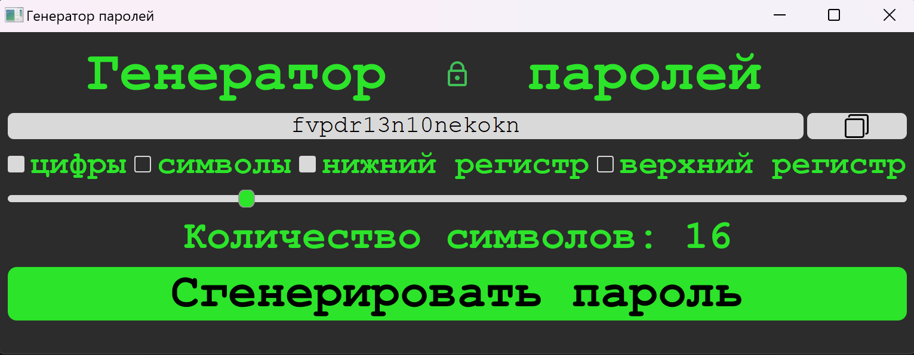

# 🔑 GENERATE-PASSWORD-PYQT

## 🔧 Установка

1. Склонируйте репозиторий:
```
git clone https://github.com/FeodorCore/generate_password_pygt
```

2. Установите завиcимости:
```
pip install -r requirements.txt
```

## 🧩 Пример работы


## 📁 Структура проекта
```
|—— convet.py
|—— generate_password.ui
|—— image
|    |—— icon_copy.png
|    |—— icon_password.png
|—— main.py
|—— pattern.py
|—— requirements.txt
```
